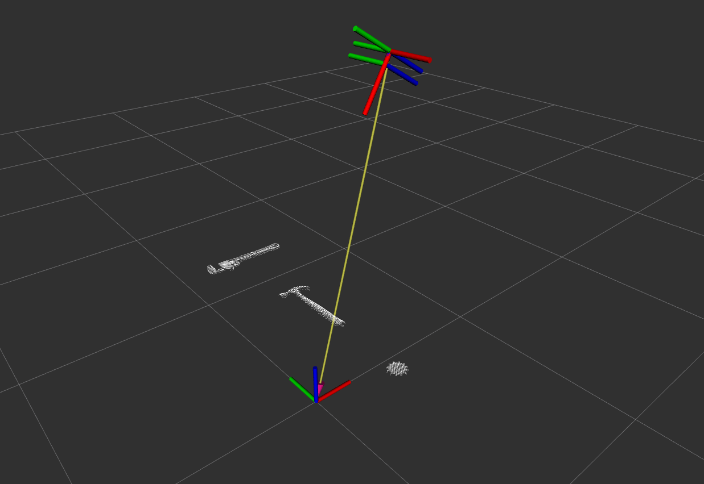
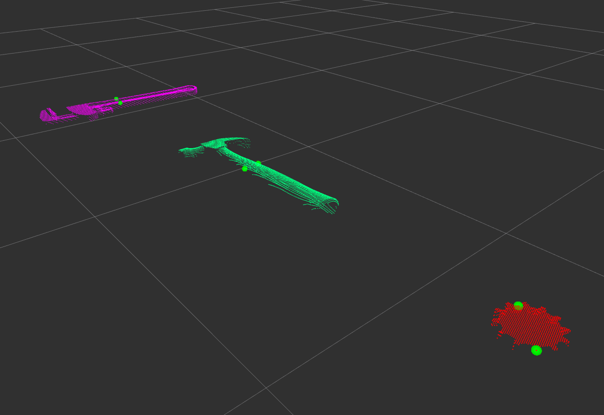

# Grasp Point Detection from Object Top-Surface using RGB-D images 

## *RBE 450x: Vision Based Robotic Manipulation - Worcester Polytechnic Institute, Fall 2023*

This repository contains the code for the Vision-Based Manipulation project as part of WPI's Vision Based Manipulation course. The project utilizes top surface information from an RGBD camera to find grasping points.

## ROS2 and Gazebo Version

This project is developed and tested with ROS2 Humble and Gazebo version 11.10.2

## Table of Contents
- [Introduction](#introduction)
- [Installation](#installation)
- [Usage](#usage)
- [References](#references)

## Introduction

The central focus of the repository is to find stable grasping points considering a parallel-jaw gripper and given the point cloud data of the top-surface of the object. 

## Installation

#### Install ROS2 Humble
For ROS2 Humble installation on Ubuntu 22.04 refer to the following link [Install ROS2 Humble](https://docs.ros.org/en/humble/Installation/Ubuntu-Install-Debians.html) 

#### Install Gazebo 11.10.2
- Install Gazebo and its supplementry files:
```bash
sudo sh -c 'echo "deb http://packages.osrfoundation.org/gazebo/ubuntu-stable
`lsb_release -cs` main" > /etc/apt/sources.list.d/gazebo-stable.list'
wget https://packages.osrfoundation.org/gazebo.key -O - | sudo apt-key add -
```
- Update the apt repository:
```bash
sudo apt-get update
```
- Install Gazebo:
```bash
sudo apt-get install gazebo libgazebo-dev
```
Install Gazebo ROS2 packages:
```bash
sudo apt install ros-humble-gazebo-ros-pkgs
```

#### Install the PCL for for ROS2 humble
```bash
sudo apt-get install ros-humble-pcl-*
```

#### Install PCL development files and libraries
```bash
sudo apt install libpcl-dev
```

#### Setup the project
```bash
# Clone the repository in src folder
git clone https://github.com/hrishikesh-st/vbm_project.git

# Build the packages
cd vbm_project
colcon build

# Source the build files
source install/setup.bash
```
> NOTE: You will need to use this command in every new terminal you open, or you can add it to your .bashrc file.

## Usage

> IMPORTANT: You need to initiate extra 4 terminal sessions to run the entire project end-to-end.

### Launch the simulation
- Using the same terminal session used to source the build files spawn the simulation environment:
```
ros2 launch vbm_project_env simulation.launch.py
```
> NOTE: This will spawn a camera, table and a desired object on the table in the Gazebo environment.


### Spawn Rviz to visualize the point cloud data
- Spawn the first terminal session
- Spawn Rviz:
```
ros2 run rviz2 rviz2
```
- Change the Fixed Frame to world 

### Transform the point cloud from the camera frame to the world frame
- Spawn second terminal session.
- Spawn the node transform_point_cloud.py from the vbm_project_grasping package.
- transform_point_cloud node publishes the transformed point cloud to /transformed_pointcloud_data topic.
```
ros2 run vbm_project_grasping transform_point_cloud.py 
```
- Visualize the transformed pointcloud with the PointCloud2 message from /transformed_pointcloud_data topic.
> NOTE: The transformation for the current version is hardcoded into a transformation matrix. The future scope is to utilise the tf2 library.


### Pre-process the transformed point cloud data using the PCL library
- Spawn third terminal session.
- Spawn the processPointCloud CPP node from the vbm_project_grasping package.
- processPointCloud node downsamples the data, removes the major plane and extracts the point cloud of the object of interest.
- This node subscribes to /transformed_pointcloud_data topic and then publishes the processed point cloud to /processed_pointcloud_data topic.
```
ros2 run vbm_project_grasping processPointCloud
```
- Visualize the processed pointcloud with the PointCloud2 message from /processed_pointcloud_data topic.


### Detect the best grasping points using heuristic exhaustive search
- Spawn the fourth terminal session.
- Spawn the grasp_synthesis_node.py node from the vbm_project_grasping package:
```
ros2 run vbm_project_grasping grasp_synthesis_node.py
```
- Following operations are performed on the processed point cloud data:
    - Distance thresholds the processed point cloud from the topmost point in the cloud and extracts the top-surface of the object.
    - Now this top-surface is flattened to a 2D point cloud to perform the grasp point detection heuristic alogorithm.
    - Queries the detected grasp points back to the 3D point cloud.
- This node subscribes to /processed_pointcloud_data topic and then publishes to two topics:
    - /thresholded_pointcloud: to visualize the top-suface of the object.
    - /grasping_points: to visualize the detected top-surface grasping points of the object.
- Visualise the best grasping points in the Marker message from the /grasping_points topic.
- Visualize the PointCloud2 message from the /processed_pointcloud_data topic and Marker message from the /grasping_points topic simultaneously. 
- This way you can visualize the location of grasping points on the processed point cloud essentially indicating the grasp points on the top-surface of the object.
 

## References